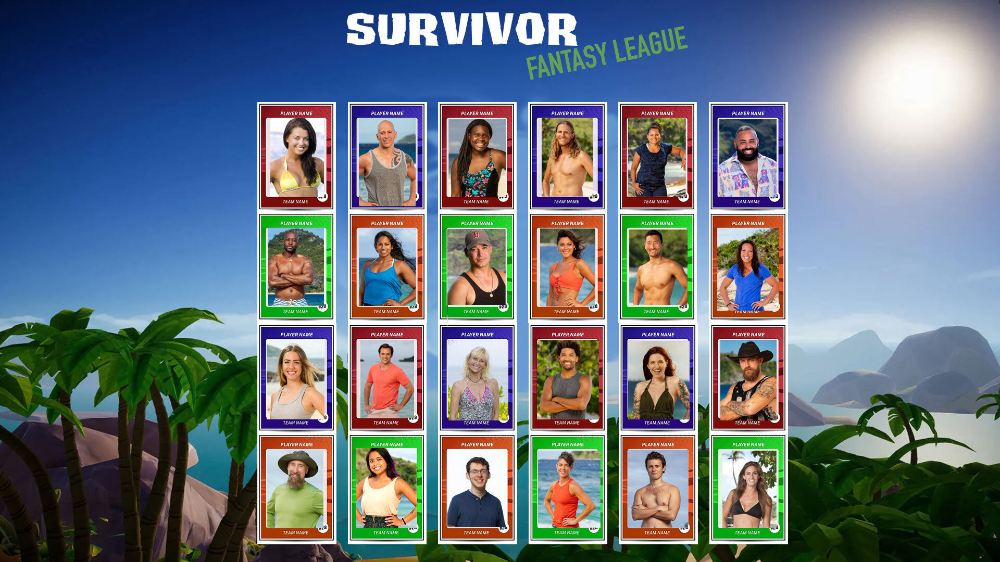

# Survivor Fantasy League

#### A full-stack web application built as third project.

## Description
Fantasy League Survivor card game that takes the winners of 24 seasons from the survivor franchise. We give the user the freedom to create their own survivor/survivors to be able to generate the winners based on a random outcome. 

## Table of Contents
* [Technologies Used](#technologiesused)
* [Features](#features)
* [Design](#design)
* [Project Next Steps](#nextsteps)
* [Deployed App](#deployment)
* [About the Author](#author)

## Technologies Used
* Node
* Express
* Mongoose
* CRUD
* HTML
* CSS
* cors

## Features
As a user, I want to see all players contestants listed out in a gallery as player cards with their name, picture, and season(s) played.
As a user, I want to be able to view more details of each player card, displaying all stats of the selected player.
As a user, I want to edit the number of contestants by adding or removing players.
As a user, I want to be able to add new contestants based off winners of the newest seasons.
As a user, I want a scenario to run once I complete my team which randomizes a final 3.

## Design
* Design elements implemented using HTML and CSS. 

## Project Next Steps
* Allow users to create their own "dream team" of 12 contestants.
* Add a feature like challenges which would generate winners of challenges based on contestant stats. 
* Add a sign in feature so you can continue to use your own contestants that you have created to find the final three after a given amount of time.   
* Implement more pages and routes that make the user feel like they are more in control of their own card game.
* Having visual indicators when someone is merged or exiled, this way the user can see who is merged and exiled instead of trying to remember that. 
* Generate outcome button having more detailed results with metrics based on votes cast, challenge wins, etc... Just have it mirror realistic survivor seasons. 
* Adding sound to the application as a whole. Reactive sounds and "waiting" sounds.    

## Deployed Link
[Netlify](https://dev--survivorfantasyleague.netlify.app/)

* You can view the repository:
[Github.com](https://github.com/jafbath/survivorProject)
* If unable to view please go live locally through VS Code

## About the Author
* Being our (James Fagan, Jillian Tanda, Pepper Rostamizadeh) first group project I feel like we "ham and egged" very well with proper planning steps in order to feel comfortable with what we produced as a product. Dividing responsibilities according to what each person felt confident in and fluent communication made this project flow smoothly.   
 
    
## Works Cited:
* Referencing previous class lessons for some of the more in depth concepts of using map() and forms. 